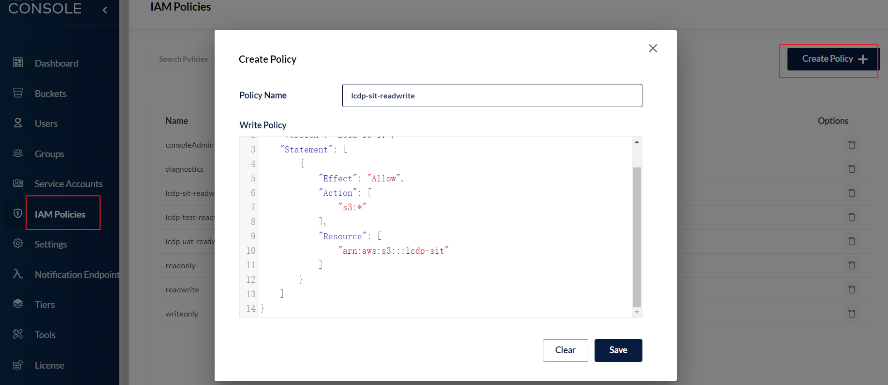
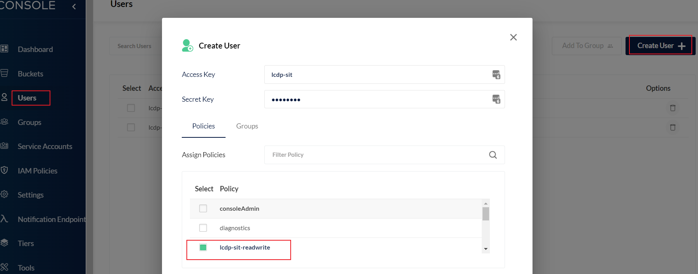
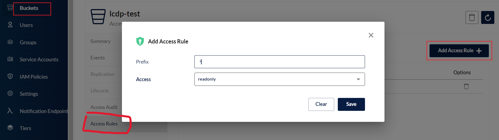

# minio

+ 设置登录用户读写权限

  + 创建仅可读写指定`bucket`的策略

     

    ```
    {
        "Version": "2012-10-17",
        "Statement": [
            {
                "Effect": "Allow",
                "Action": [
                    "s3:*"
                ],
                "Resource": [
                	# lcdp-sit 是bucket名称,前面得*表示可以有前缀，用以支持bladex得多租户策略，后面得/*必须加，fou'ze
                    "arn:aws:s3:::*lcdp-sit/*"
                ]
            }
        ]
    }
    ```

  + 创建拥有该策略的用户

     

+ 设置匿名用户只读

  > 进入`bucket`设置页面，点击`Access Rules`，删除所有策略，添加下图策略
  >
  > + `prefix`：`bucket`中文件前缀
  > + `Access`：匿名用户权限

  

  

